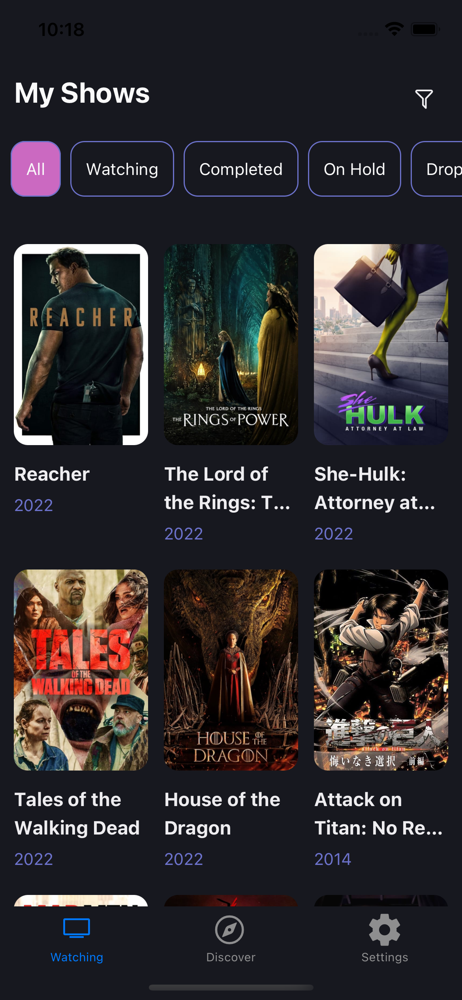
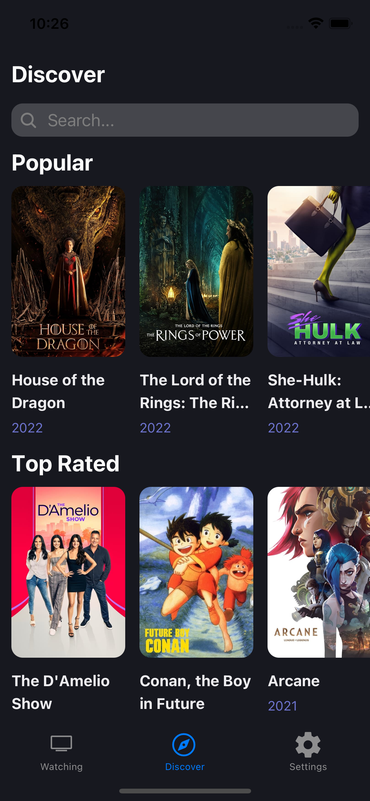
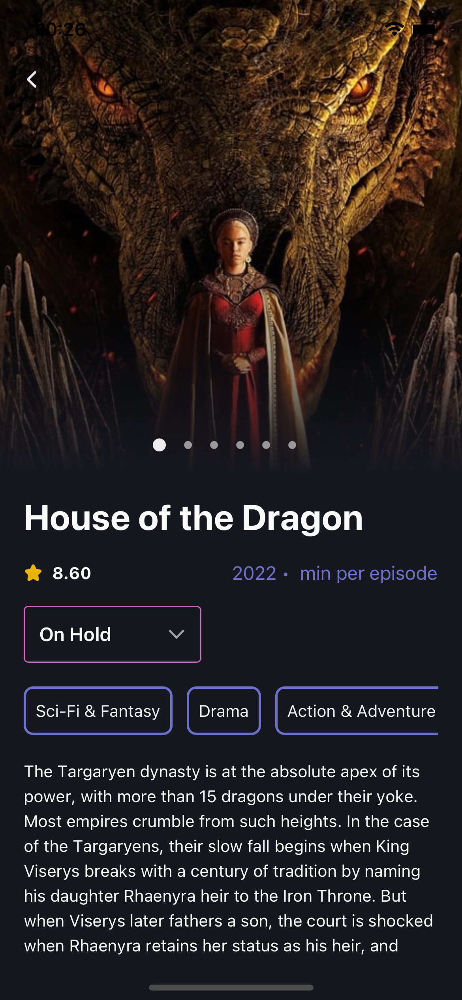
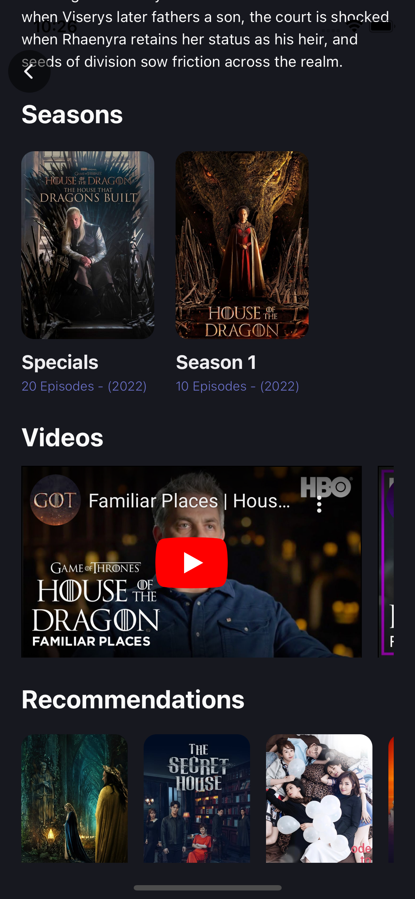
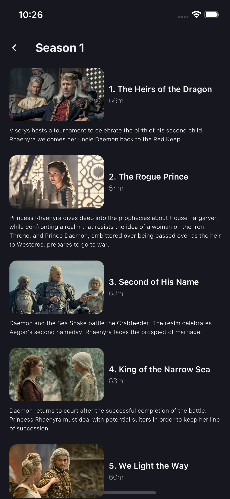

## Show Tracker App

### React Native app that allows users to search for TV shows and keep track of what they're currently watching or plan to watch, plus more.

- Built using Expo, firebase, react-navigation, react-native-reanimated, and react-native-gesture-handler

### Running the app

```sh
$ git clone https://https://github.com/chris24elias/show-tracker-app.git

$ cd show-tracker-app

$ yarn

ios:

$ yarn ios

android:

$ yarn android
```

# Demo

<p float="left">
  
   
</p>
<p float="left">
   
  
</p>
<p float="left">
   
   
</p>
<p float="left">
  
</p>
